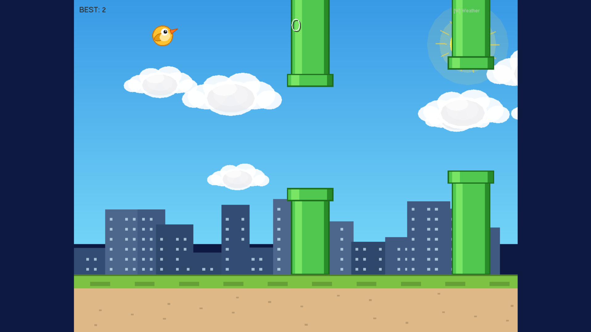
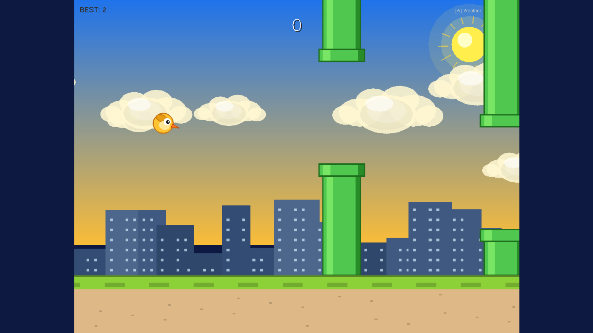
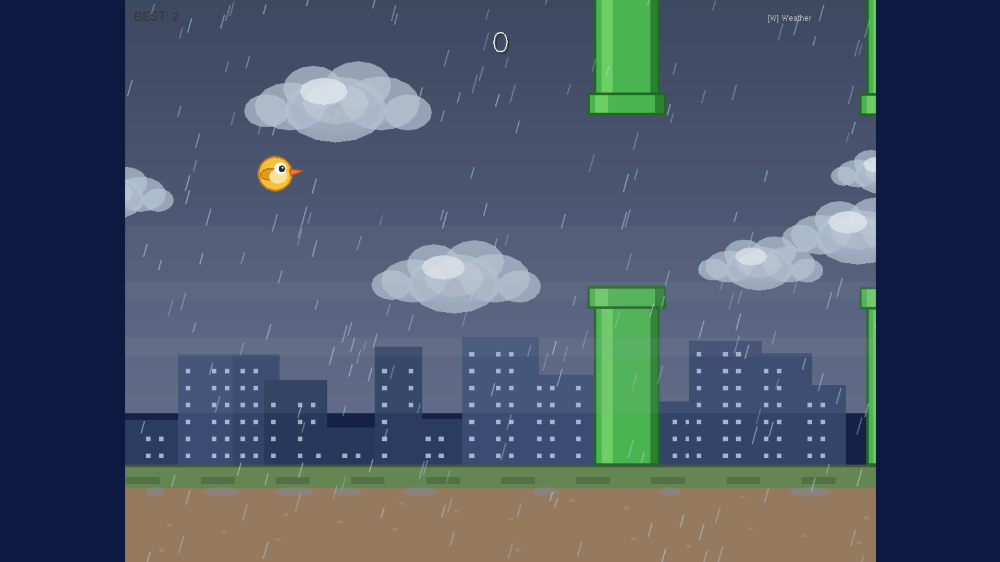
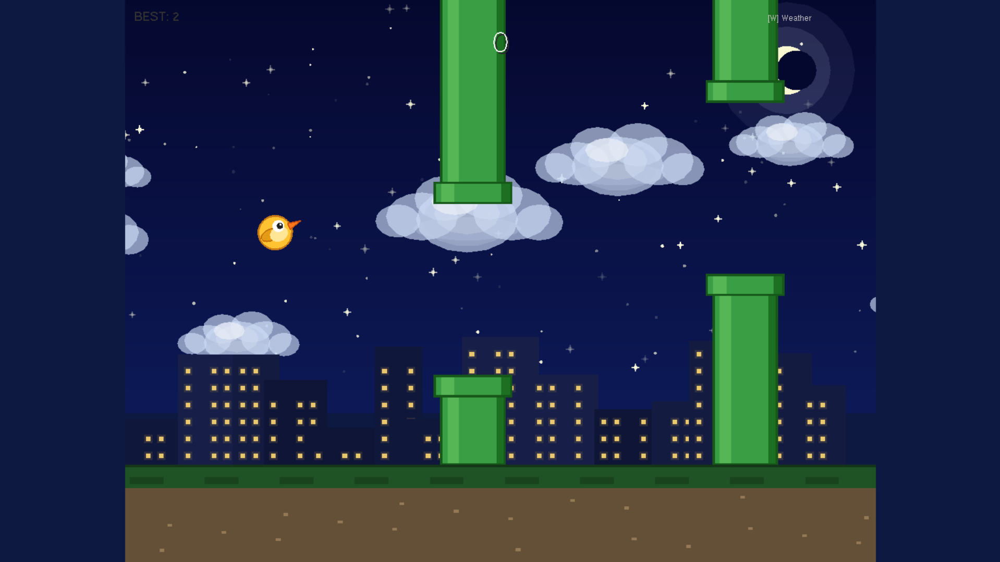

<p align="center">
  
  
  
  
  
</p>

<h1 align="center">Flappy Bird — OpenGL Edition</h1>

<p align="center">
  <b>A fully playable, visually polished Flappy Bird clone built entirely in C using OpenGL and GLUT.</b><br/>
  Developed as a Computer Graphics Lab Project — no external game engines, no image assets, pure code.
</p>

<p align="center">
  <a href="#features">Features</a> &nbsp;|&nbsp;
  <a href="#prerequisites">Prerequisites</a> &nbsp;|&nbsp;
  <a href="#setup-and-installation">Setup</a> &nbsp;|&nbsp;
  <a href="#building-and-running">Build and Run</a> &nbsp;|&nbsp;
  <a href="#controls">Controls</a> &nbsp;|&nbsp;
  <a href="#code-architecture">Architecture</a> &nbsp;|&nbsp;
  <a href="#license">License</a>
</p>

---

## Overview

This project is a complete Flappy Bird clone written from scratch in C using OpenGL and FreeGLUT. Every visual element — the bird, pipes, clouds, background, ground, city silhouette, rain, stars, sun and moon — is drawn entirely with OpenGL primitives such as quads, triangles and parametric circles. No image files or external assets are used.

The game features four dynamic weather modes that change the entire visual atmosphere of the scene. All graphics run at 60 frames per second using a GLUT timer-based game loop with double buffering.

---

## Features

### Bird Mechanics
- Gravity-based physics applied every frame
- Flap upward with Space bar or left mouse click
- Smooth tilt interpolation — bird tilts nose-up on flap and nose-down on fall
- Three-frame wing animation (up, mid, down) cycling continuously

### Pipe System
- Three simultaneous pipe pairs scrolling from right to left
- Randomly generated gap height on each recycle
- Wider gap and gentler speed ramp for fair and enjoyable difficulty
- Progressive difficulty — pipe speed increases slightly each frame

### Collision Detection
- Circle vs. AABB (Axis-Aligned Bounding Box) test against each pipe segment
- Ground and ceiling boundary checks
- Slightly reduced hitbox radius for a forgiving feel

### Scoring
- Score increments each time the bird passes through a pipe pair
- Session high score retained in memory throughout the session
- Large centred score display with drop shadow
- High score shown in the top-left corner

### Dynamic Weather System
The background scenario changes automatically every 30 seconds and can also be changed manually at any time by pressing W.

| Mode   | Sky                    | Special Elements                              |
|--------|------------------------|-----------------------------------------------|
| Day    | Bright blue gradient   | Animated sun with pulsing rays                |
| Sunny  | Warm golden gradient   | Larger animated sun, warmer cloud tones       |
| Rain   | Dark overcast grey     | 220 rain particles, zigzag lightning, fog     |
| Night  | Deep navy gradient     | 110 twinkling stars, glowing crescent moon    |

<p align="center">
  
  
</p>
<p align="center">
  
  
</p>

All scene elements adapt to the active weather mode including pipe colour tint, ground grass colour, building brightness and window glow colour.

### Visual Effects
| Effect              | Description                                                 |
|---------------------|-------------------------------------------------------------|
| Sky gradient        | Two-stop interpolated gradient from horizon to zenith       |
| Parallax clouds     | Seven clouds across two speed layers wrapping continuously  |
| Beautiful clouds    | Eight overlapping ellipses with shadow, depth tint and highlight |
| City silhouette     | Fourteen procedural buildings with pseudo-random lit windows |
| Scrolling ground    | Animated grass tile pattern synced to pipe scroll speed     |
| Screen shake        | Fifteen-frame camera shake triggered on collision           |
| Death flash         | White flash overlay on bird death                           |
| Weather flash       | Brief white flash on weather change                         |
| Pulsing UI text     | Sin-driven alpha animation on prompts and score             |
| Aspect ratio lock   | Pillarbox or letterbox viewport for any window size         |
| Full screen launch  | Game starts in full screen, toggled with F11                |

### Game States

```
[Title Screen] --SPACE--> [Playing] --P--> [Paused] --P--> [Playing]
                               |
                          (Collision)
                               |
                               v
                        [Game Over] --SPACE or R--> [Playing]
```

---

## Prerequisites

| Requirement      | Details                                                              |
|------------------|----------------------------------------------------------------------|
| Operating System | Windows 7, 8, 10 or 11                                              |
| IDE              | Code::Blocks with MinGW bundled (codeblocks-XX.XX-mingw-setup.exe)  |
| Graphics Library | FreeGLUT for MinGW                                                   |
| Compiler         | GCC (MinGW) — included with the Code::Blocks installer               |
| C Standard       | C99 or later                                                         |

---

## Setup and Installation

### Step 1 — Install Code::Blocks with MinGW

Download the installer that includes MinGW from:

```
https://www.codeblocks.org/downloads/binaries/
```

Choose the file named `codeblocks-XX.XX-mingw-setup.exe`. Run the installer and use default settings. GCC is bundled automatically.

---

### Step 2 — Download FreeGLUT

Download the MinGW package of FreeGLUT from:

```
https://www.transmissionzero.co.uk/software/freeglut-devel/
```

Extract the ZIP archive. Inside you will find:

```
freeglut/
    bin/           <-- freeglut.dll
    include/GL/    <-- glut.h, freeglut.h and related headers
    lib/           <-- libfreeglut.a, libfreeglut_static.a
```

---

### Step 3 — Copy FreeGLUT Files into MinGW

The default MinGW location is `C:\Program Files\CodeBlocks\MinGW\`. Adjust this path if yours differs.

| Copy from FreeGLUT          | Paste into MinGW folder              |
|-----------------------------|--------------------------------------|
| `include\GL\` (all .h files) | `<MinGW>\include\GL\`              |
| `lib\libfreeglut.a`          | `<MinGW>\lib\`                     |
| `lib\libfreeglut_static.a`   | `<MinGW>\lib\`                     |
| `bin\freeglut.dll`           | Place next to your compiled .exe   |

For the DLL, copy `freeglut.dll` into the `bin\Debug\` folder inside the project directory. This is where Code::Blocks places the compiled executable.

---

### Step 4 — Clone This Repository

```bash
git clone https://github.com/labonysur-cloud/flappybird.git
cd flappybird
```

---

## Building and Running

### Option A — Code::Blocks (Recommended)

1. Open `FlappyBird.cbp` in Code::Blocks
2. Press F9 to build and run

The project file already contains the correct linker flags:

```
-lopengl32 -lglu32 -lfreeglut -lm
```

The game window opens in full screen automatically. Press F11 to switch to windowed mode.

---

### Option B — Manual MinGW Command Line

Open Command Prompt in the project directory and run:

```bash
gcc flappy_bird.c -o flappy_bird.exe -lopengl32 -lglu32 -lfreeglut -lm -std=c99
flappy_bird.exe
```

Make sure `freeglut.dll` is in the same folder as `flappy_bird.exe`.

---

### Option C — Custom Code::Blocks Project

If you create a new project manually, go to:

**Project -> Build options -> Linker settings -> Other linker options**

and add:

```
-lopengl32 -lglu32 -lfreeglut -lm
```

---

## Controls

| Input             | Action                                      |
|-------------------|---------------------------------------------|
| Space             | Flap / Start game / Restart after death     |
| Left mouse click  | Same as Space                               |
| W                 | Cycle weather mode (Day / Sunny / Rain / Night) |
| P                 | Pause or unpause                            |
| R                 | Restart from Game Over screen               |
| F11               | Toggle full screen and windowed mode        |
| ESC               | Quit                                        |

---

## Project Structure

```
flappybird/
    flappy_bird.c       Complete game source code (~1100 lines, single file)
    FlappyBird.cbp      Code::Blocks project file with linker flags
    README.md           This file
    LICENSE             MIT License
    .gitignore          Excludes build output and binary files
```

The entire game is contained in a single `.c` file for easy submission, review and lab presentation.

---

## Code Architecture

The source file is divided into clearly labelled sections with comments explaining each part.

### Initialisation Functions

| Function          | Responsibility                                                   |
|-------------------|------------------------------------------------------------------|
| `init()`          | OpenGL state, projection matrix, random seed, calls all sub-inits |
| `initBird()`      | Reset bird position, velocity, tilt and animation frame          |
| `initPipes()`     | Spawn three pipe pairs at staggered X positions with random gaps |
| `initClouds()`    | Place seven clouds at random positions with two speed layers     |
| `initBuildings()` | Generate fourteen city silhouette buildings with random sizes    |
| `initRain()`      | Initialise 220 rain particle positions, speeds and lengths       |
| `initStars()`     | Initialise 110 star positions, sizes and twinkle phase offsets   |
| `resetGame()`     | Full game reset — resets score, speed and all game objects       |

### Rendering Pipeline

```
display()
    drawBackground()        Weather-aware sky gradient
    drawSun()               Animated sun with pulsing rays (Day and Sunny modes)
    drawStars()             110 twinkling star sprites (Night mode)
    drawMoon()              Crescent moon with craters and glow (Night mode)
    drawClouds()            Seven clouds, each made of eight overlapping ellipses
    drawCitySilhouette()    Fourteen buildings with weather-tinted windows
    drawPipes()             Three pipe pairs with cap, highlight and shadow stripes
    drawGround()            Grass layer, dirt, scrolling tile detail, puddles in rain
    drawBird()              Body, animated wing, belly, eye with shine, beak
    drawHUD()               Centred score, top-left high score, weather indicator
    drawFog()               Layered fog bands (Rain mode only)
    drawRain()              220 angled rain particle lines (Rain mode only)
    drawLightning()         Zigzag lightning bolt with glow pass (Rain mode only)
    drawWeatherName()       Fading weather name announcement on mode change
    drawTitleScreen()       Animated logo, bobbing bird, pulsing start prompt
    drawGameOverScreen()    Score panel with restart prompt
    drawPauseScreen()       Dimmed overlay with resume instruction
```

### Game Logic Functions

| Function            | Responsibility                                                  |
|---------------------|-----------------------------------------------------------------|
| `updateGame()`      | Master dispatcher — calls appropriate updates per game state    |
| `updateBird()`      | Apply gravity, clamp velocity, compute tilt angle, step wing    |
| `updatePipes()`     | Scroll pipes, recycle off-screen pairs, detect score events     |
| `updateClouds()`    | Scroll and wrap each cloud to the right edge                    |
| `updateRainDrops()` | Move rain particles downward and recycle off-screen drops       |
| `updateWeather()`   | Advance auto-cycle timer, manage lightning trigger              |
| `updateShake()`     | Decay screen shake offset each frame                            |
| `checkCollision()`  | Circle-AABB test against pipes plus ground and ceiling bounds   |
| `nextWeather()`     | Advance to the next weather mode and trigger transition effects |

### Input and Timing

| Function          | Responsibility                                                   |
|-------------------|------------------------------------------------------------------|
| `timerCallback()` | GLUT timer firing every 16ms to drive 60 FPS update and redraw  |
| `doFlap()`        | Unified flap handler for start, in-play flap and restart        |
| `keyboardInput()` | ASCII key handler: Space, W, P, R, ESC                          |
| `specialKeys()`   | Special key handler: F11 for full screen toggle                 |
| `mouseInput()`    | Left click maps to doFlap                                       |
| `reshape()`       | Computes pillarbox or letterbox viewport on window resize        |

### Tunable Physics Constants

```c
#define GRAVITY          -0.45f    /* Downward acceleration per frame          */
#define FLAP_VEL          10.0f    /* Upward velocity applied on flap          */
#define MAX_FALL_VEL     -13.0f    /* Terminal fall velocity                   */
#define PIPE_GAP         190.0f    /* Vertical gap between pipes (larger = easier) */
#define PIPE_SPACING     290.0f    /* Horizontal distance between pipe pairs   */
#define PIPE_BASE_SPEED    2.7f    /* Starting scroll speed in pixels per frame */
#define PIPE_SPEED_INC     0.002f  /* Speed increase per frame (difficulty ramp) */
#define WEATHER_CYCLE_FRAMES 1800  /* Frames between automatic weather changes  */
```

---

## Key Technical Concepts

| Concept                    | Where Used                                                       |
|----------------------------|------------------------------------------------------------------|
| Orthographic 2D projection | `gluOrtho2D(0, 800, 0, 600)` defines the world coordinate space |
| Double buffering           | `GLUT_DOUBLE` prevents screen tearing and flickering            |
| Timer-based game loop      | `glutTimerFunc(16, callback, 0)` drives a fixed 60 FPS timestep |
| Alpha blending             | `glEnable(GL_BLEND)` enables transparent overlays and clouds    |
| Matrix transforms          | `glRotatef` and `glScalef` handle bird tilt and ellipse drawing |
| Parametric circles         | `cos(a), sin(a)` constructs bird body, clouds and circle fills  |
| Linear interpolation       | `lerpf()` smooths bird tilt angle toward its target each frame  |
| Parallax scrolling         | Two cloud layers at different speeds give a depth illusion      |
| Circle-AABB collision      | Efficient per-pipe hit test with forgiving hitbox radius        |
| Weather state machine      | Four themes define sky colours, cloud tints and special effects |

---

## Sound Extension

Sound stubs are included as comments at the bottom of `flappy_bird.c`. To add audio, use the Windows Multimedia API:

```c
#include <windows.h>
#include <mmsystem.h>
/* Add -lwinmm to linker flags */

void playSound(int id) {
    const char *files[] = {"flap.wav", "score.wav", "die.wav"};
    PlaySound(files[id], NULL, SND_FILENAME | SND_ASYNC);
}
```

Then uncomment the three `playSound()` calls in the source at the flap, score and collision events.

---

## Troubleshooting

| Problem                                  | Solution                                                        |
|------------------------------------------|-----------------------------------------------------------------|
| `fatal error: GL/glut.h: No such file`   | Copy FreeGLUT headers into `<MinGW>\include\GL\`               |
| `undefined reference to glutInit`        | Add `-lfreeglut` to linker settings in Code::Blocks            |
| `The program cannot start: freeglut.dll` | Copy `freeglut.dll` into the same folder as the `.exe`         |
| Window opens and immediately closes      | Run from Command Prompt to see the error output                |
| Slow or choppy animation                 | Build in Release mode instead of Debug                         |
| Window appears black                     | Update your graphics card drivers                              |
| Game does not go full screen             | Press F11 inside the game window to toggle                     |

---

## Possible Extensions

- Add WAV sound effects for flap, score and death events
- Save high score to a text file between sessions
- Add a medal system based on score thresholds
- Add more pipe colour variations per weather mode
- Port to Linux or macOS using the system freeglut package

---

## Author

**Labony Sur**
Computer Science and Engineering
Computer Graphics Laboratory Project

- GitHub: https://github.com/labonysur-cloud
- Email: labonysur473@gmail.com

---

## License

This project is licensed under the MIT License. See the LICENSE file for full details.

```
MIT License

Copyright (c) 2026 Labony Sur

Permission is hereby granted, free of charge, to any person obtaining a copy
of this software and associated documentation files (the "Software"), to deal
in the Software without restriction, including without limitation the rights
to use, copy, modify, merge, publish, distribute, sublicense, and/or sell
copies of the Software, and to permit persons to whom the Software is
furnished to do so, subject to the following conditions:

The above copyright notice and this permission notice shall be included in all
copies or substantial portions of the Software.

THE SOFTWARE IS PROVIDED "AS IS", WITHOUT WARRANTY OF ANY KIND, EXPRESS OR
IMPLIED, INCLUDING BUT NOT LIMITED TO THE WARRANTIES OF MERCHANTABILITY,
FITNESS FOR A PARTICULAR PURPOSE AND NONINFRINGEMENT. IN NO EVENT SHALL THE
AUTHORS OR COPYRIGHT HOLDERS BE LIABLE FOR ANY CLAIM, DAMAGES OR OTHER
LIABILITY, WHETHER IN AN ACTION OF CONTRACT, TORT OR OTHERWISE, ARISING FROM,
OUT OF OR IN CONNECTION WITH THE SOFTWARE OR THE USE OR OTHER DEALINGS IN
THE SOFTWARE.
```

---

<p align="center">
  Built with C, OpenGL and GLUT &nbsp;|&nbsp; Computer Graphics Laboratory 2026
</p>
